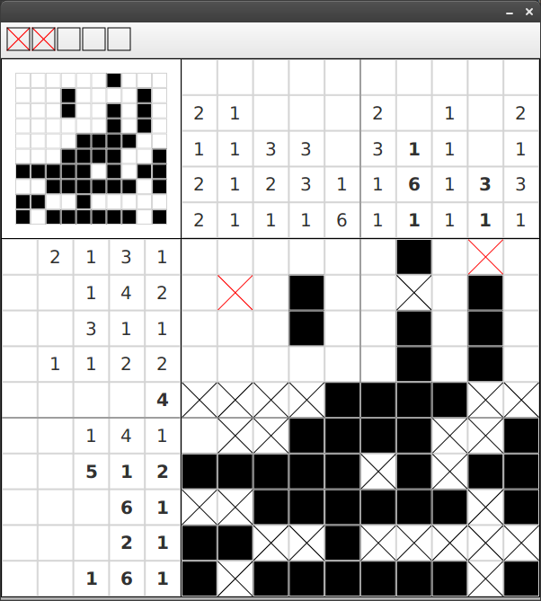

# Nonogram

This is a small [Nonogram](https://en.wikipedia.org/wiki/Nonogram) puzzle game written
in JavaFX 8. 

The game consists of a central grid and some numbers on top of each column and on the side of each rows. The numbers tell the user how many connected filled fields are located in the column/row. The task of the user is to find out which fields are "filled" and which are not.

At the moment the game creates a random puzzle on every start.

### Play the Game

You can download a runnable JAR from the [release-secton](https://github.com/lestard/nonogram/releases/download/v0.1.0/nonogram.0.1.0.jar) of github.
To run the game you need Oracles Java Runtime in version 8 installed.

### Build the game

The game is created with Java version 8 and JavaFX. 

The build system is [gradle](http://http://www.gradle.org/). To build the project you can
type `./gradlew build` (on linux/mac console) or `gradlew.bat build` (on windows console). (You *don't* need to have gradle installed)

### Create Executables

A runnable JAR can be created with `gradle shadowJar`. The JAR file is then located under `build/libs/nonogram-all.jar`
